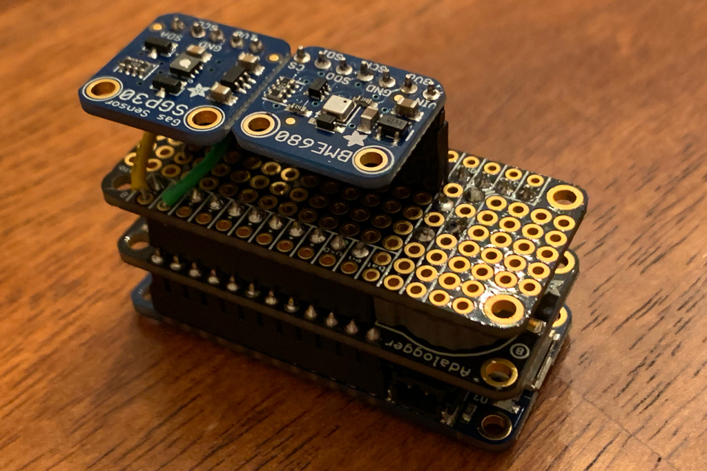
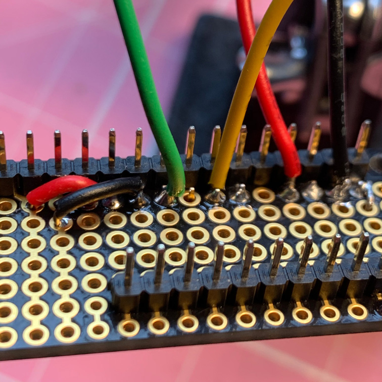

# Feather Express Device Assembly and Usage

As mentioned in the [main project description](../README.md), one of the two Arduino-based devices I created for this project is built around the [Adafruit Feather nRF52840 Express](https://learn.adafruit.com/introducing-the-adafruit-nrf52840-feather).  This document contains the parts list, details of the build process, and an overview of software installation and usage.

As also described in the [project description](../README.md), I'm using the SGP30 to sense tVOCs.  To really use the SGP30 properly, though, it's best to have a humidity sensor, a real-time clock (RTC), and some means of storing some baseline calibration data in non-volatile memory. Unlike the Feather Sense, the Feather Express doesn't have a humidity sensor on board, so I used a spare [Adafruit BME680 breakout board](https://learn.adafruit.com/adafruit-bme680-humidity-temperature-barometic-pressure-voc-gas) I had sitting around unused.  I chose Adafruit's [Adalogger FeatherWing](https://learn.adafruit.com/adafruit-adalogger-featherwing) for RTC and for non-volatile memory.  

## Parts List

Adafruit is [currently selling through Digi-Key](https://www.adafruit.com/buyfromdigikey), so I've included Digi-Key links, too. 

* [Adafruit Feather nRF52840 Express](https://learn.adafruit.com/introducing-the-adafruit-nrf52840-feather) [[Digi-Key](https://www.digikey.com/product-detail/en/adafruit-industries-llc/4062/1528-2828-ND/9843410)]
* [Adafruit SGP30 TVOC/eCO2 Gas Sensor](https://learn.adafruit.com/adafruit-sgp30-gas-tvoc-eco2-mox-sensor) [[Digi-Key](https://www.digikey.com/product-detail/en/adafruit-industries-llc/3709/1528-2531-ND/8258468)]
* [Adafruit BME680 breakout board](https://learn.adafruit.com/adafruit-bme680-humidity-temperature-barometic-pressure-voc-gas) [[Digi-Key](https://www.digikey.com/product-detail/en/adafruit-industries-llc/3660/1528-2444-ND/7915571)]
* [Adalogger FeatherWing](https://learn.adafruit.com/adafruit-adalogger-featherwing) [[Digi-Key](https://www.digikey.com/product-detail/en/adafruit-industries-llc/2922/1528-1621-ND/5885911)]
* CR1220 Coin Cell Battery [[Digi-Key](https://www.digikey.com/product-detail/en/panasonic-bsg/CR1220/P033-ND/269740)]
* [FeatherWing Proto](https://www.adafruit.com/product/2884) [[Digi-Key](https://www.digikey.com/product-detail/en/adafruit-industries-llc/2884/1528-1622-ND/5777193)]
* [Short Feather Female Headers (2)](https://www.adafruit.com/product/2940) [[Digi-Key](https://www.digikey.com/product-detail/en/adafruit-industries-llc/2940/1528-1581-ND/5848449)]
* [Short Feather Male Headers (2)](https://www.adafruit.com/product/3002) [[Digi-Key](https://www.digikey.com/product-detail/en/adafruit-industries-llc/3002/1528-2039-ND/6827172)]
* Male Headers [[Amazon](https://www.amazon.com/Header-Lystaii-Pin-Connector-Electronic/dp/B06ZZN8L9S)]
* Female Headers [[Amazon](https://www.amazon.com/gp/product/B07CGGSDWF)]
* Breadboard (for help in holding headers in place while soldering)
* Breadboard wire: red, black, green, and yellow
* SD Card
* Optional: [Lithium Ion Polymer Battery - 3.7V 400mAh](https://www.adafruit.com/product/3898) [[Digi-Key](https://www.digikey.com/product-detail/en/adafruit-industries-llc/3898/1528-2731-ND/9685336)]

## Notes, Tips, and Disclaimers

**Note**: I'm using green wire for all the SCL connections and yellow for SDA.  And, as usual, red and black for power and ground, respectively.

**Tip**: thumbnails below are linked to a higher resolution version.

**Disclaimer**: I'm a programmer, not an electrical engineer, so don't be surprised if you sense an overarching theme of weird layout choices and lousy soldering.  But, hey, it all worked, first try! 

## Build It!

OK, let's go!

### Gather Parts

* BME680
* SGP30
* Adalogger FeatherWing
* Feather Express
* 5-pin male header
* 5-pin female header
* 7-pin male header
* 7-pin female header
* 11-pin short male header
* 11-pin short female header
* 12-pin short male header
* 12-pin short female header
* two 16-pin short male headers
* two 16-pin short female headers

### Male Headers on BME680 and SGP30

I already had pins soldered on, as shown in the photo above, but there's nothing complicated here.  Just solder on male headers to the two sensor breakout boards.

### Female Headers on Feather Express

We'll start by soldering some short female headers onto the Feather Express.  I used some long male headers pushed into a breadboard to stabilize things for soldering.

 

### Male Headers on Adalogger FeatherWing

Now solder on the short male headers to the underside of the Adalogger FeatherWing, long end of the pins down into the breadboard, so that you're soldering the short ends to the Adalogger FeatherWing.

 

### Female Headers on Adalogger FeatherWing

Now solder on the short female headers to the top side of the Adalogger FeatherWing.

### Test Fit

Do a quick test fit and continuity test with a multimeter.

 

### Male Headers on FeatherWing Proto

Now solder on the short male headers to the underside of the Adalogger FeatherWing, long end of the pins down into the breadboard, so that you're soldering the short ends to the FeatherWing Proto.

 

### Female Headers on FeatherWing Proto

Now solder the 5-pin and 7-pin female headers onto the top side of the FeatherWing Proto.  But don't solder all the pins just yet.  Refer to the photo below and only solder the three shown.

### Wiring

Get some red and black wire and start wiring up power and ground as shown.

 
 

Now do the green and yellow wiring as shown.  Remember green is for SCL and yellow is SDA.

 
 
 
 
 
 
 
 
 
 

### Final Assembly and Testing

Now fit everything together and admire your work!  ...OK...well, do full continuity tests and *then* admire your work.  ;-)

 
 
 

## Software

### Initial Setup

For initial software setup, there's no point in my trying to improve on what Adafruit already offers, so it's really easiest to just start with their [excellent instructions](https://learn.adafruit.com/introducing-the-adafruit-nrf52840-feather/arduino-bsp-setup) for getting your Arduino IDE all set up for the Feather Express.  Do that first, and then it's probably not a bad idea to run some of their [tests](https://learn.adafruit.com/introducing-the-adafruit-nrf52840-feather/arduino-board-setup) too.

You'll also need set the RTC's time.  Insert the coin cell battery to the RTC breakout, and follow [Adafruit's RTC setup instructions](https://learn.adafruit.com/adafruit-adalogger-featherwing/using-the-real-time-clock).  Note that it's not the end of the world if you don't do this.  I didn't have another coin cell (or an SD card...sigh) so the code for the Feather Express in this project has RTC and SGP30 baseline calibration persistence currently disabled.

### Libraries

After that, go ahead and install the following libraries (or make sure they're already installed and up to date):

* [Neosensory Arduino Bluefruit SDK](https://neosensory.github.io/neosensory-sdk-for-bluefruit/)
* Adafruit_BME680
* Adafruit_SGP30
* Adafruit's fork of JeeLab's RTClib (make sure you're using the Adafruit one!)
* AgileWare's [CircularBuffer](https://github.com/rlogiacco/CircularBuffer)
* [Regressino](https://github.com/cubiwan/Regressino)

## Play Time!

Now that you have an Arduino Feather Express device built and setup, it's time to get it talking to your Buzz!  This project provides two options for doing so (see the [main project description](../README.md) for more details about network topology options and pros/cons):

* Feather Express directly controlling the Buzz
* An iOS device acting as a proxy between the Feather Express and the Buzz

The sections below describe each one in turn.

For either of the scenarios below, don't forget that if this is your first time connecting either the Feather or your iOS device with your Buzz, you'll need to put the Buzz into pairing mode.  With the Buzz powered on, hold down the plus and minus buttons until the LEDs turn blue.  While the Feather scans for a Buzz, you'll see a small blue LED blinking on the feather.  Once connected to the Buzz, the blue LED should be steady on. 
 
Be aware that it takes about 20 seconds for the SGP30 to warm up and start giving non-zero readings.  But you should soon start feeling buzzing in response to VOCs in the general vicinity.  You can test it out by putting it near foods (especially cooking), paint, alcohol, hand lotions, perfumes, etc.  You should feel the buzzing in the motors "lean" increase or decrease in intensity relative to the tVOC level, and also "lean" toward one end of the band or the other depending on whether the tVOC values are trending up or down. Or, if the values are fairly steady, the middle two motors will vibrate.

### Feather Express --> Buzz

Open your Arduino IDE and load the [feather-express-aq.ino](https://github.com/chrisbartley/aq-buzz/blob/master/arduino/central/feather-express-aq/feather-express-aq.ino) sketch onto your Feather Express.  Once it's running, the Feather will continuously search for a Buzz until it finds one it can connect to.  For the first try, it might be worth leaving the Feather connected to your computer with the USB cable so that you want watch the output either in the Arduino Serial Monitor or Arduino Serial Plotter. 

### Feather Express --> iOS --> Buzz

Start by opening your Arduino IDE and loading the [feather-express-aq-notify.ino](https://github.com/chrisbartley/aq-buzz/blob/master/arduino/peripheral/feather-express-aq-notify/feather-express-aq-notify.ino) sketch onto your Feather Express.  Once it's running, the Feather will wait for the iOS device to connect to it and then start broadcasting data samples.  For the first try, it might be worth leaving the Feather connected to your computer with the USB cable so that you want watch the output either in the Arduino Serial Monitor or Arduino Serial Plotter. 

Open Xcode and run the [AQ Buzz](https://github.com/chrisbartley/aq-buzz/tree/master/ios/AQ%20Buzz) app on your iOS device. Once connected to both Buzz and Feather, the app should look something like the first screenshot below.  

The AQ Buzz app can connect to multiple Feathers (see the second screenshot, below), and does proximity detection (BLE signal strength) between the iOS device and the Feathers, and sends vibrations to the Buzz according to which Feather is nearest.  So if you build more and put them around your house, you can walk around with Buzz on your wrist and the AQ Buzz app running on your phone in your pocket and feel the air quality as your move about your house.  The app orders the feathers by BLE signal strength, so you'll see them change order as you move closer to or farther from the Feathers.

 
