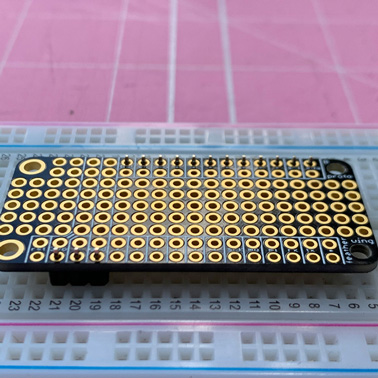
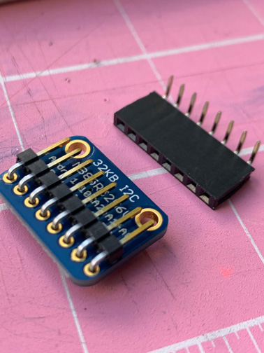
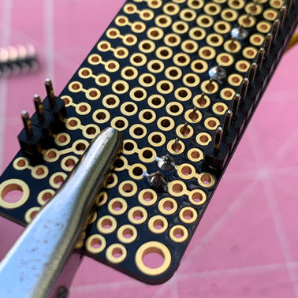
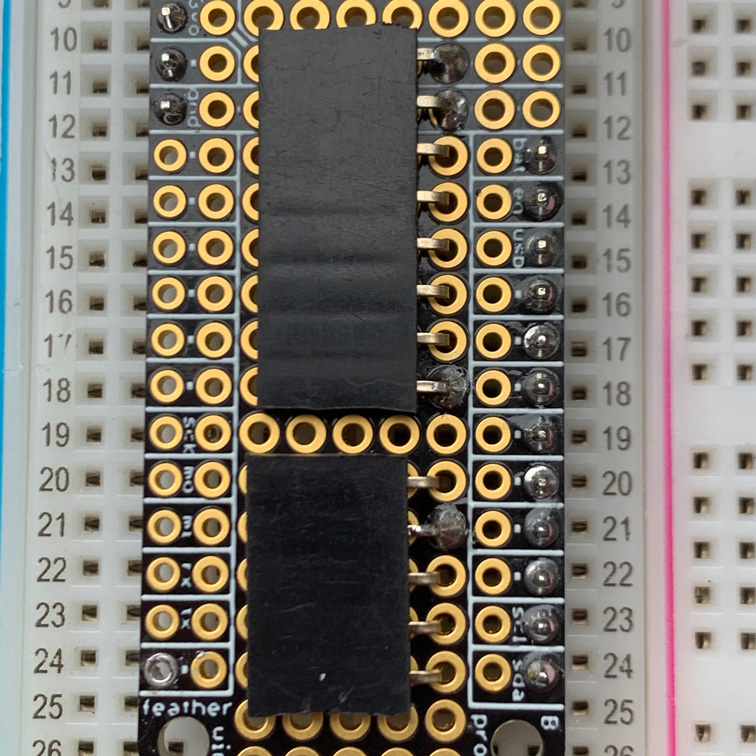

# Feather Sense Device Assembly and Usage

As mentioned in the [main project description](../README.md), one of the two Arduino-based devices I created for this project is built around the [Adafruit Feather nRF52840 Sense](https://learn.adafruit.com/adafruit-feather-sense).  This document contains the parts list, details of the build process, and an overview of software installation and usage.

As also described in the [project description](../README.md), I'm using the SGP30 to sense tVOCs.  To really use the SGP30 properly, though, it's best to have a humidity sensor, a real-time clock (RTC), and some means of storing some baseline calibration data in non-volatile memory. The Feather Sense has a humidity sensor on board, so we get that for free.  I chose Adafruit's PCF8523 breakout board for the RTC, and the Adafruit I2C FRAM breakout for non-volatile memory.  

## Parts List

Adafruit is [currently selling through Digi-Key](https://www.adafruit.com/buyfromdigikey), so I've included Digi-Key links, too. 

* [Adafruit Feather nRF52840 Sense](https://learn.adafruit.com/adafruit-feather-sense) [[Digi-Key](https://www.digikey.com/product-detail/en/adafruit-industries-llc/4516/1528-4516-ND/11684829)]
* [Adafruit SGP30 TVOC/eCO2 Gas Sensor](https://learn.adafruit.com/adafruit-sgp30-gas-tvoc-eco2-mox-sensor) [[Digi-Key](https://www.digikey.com/product-detail/en/adafruit-industries-llc/3709/1528-2531-ND/8258468)]
* [Adafruit I2C FRAM Breakout](https://learn.adafruit.com/adafruit-i2c-fram-breakout) [[Digi-Key](https://www.digikey.com/product-detail/en/adafruit-industries-llc/1895/1528-1035-ND/4990784)]
* [Adafruit PCF8523 Real Time Clock](https://learn.adafruit.com/adafruit-pcf8523-real-time-clock) [[Digi-Key](https://www.digikey.com/product-detail/en/adafruit-industries-llc/3295/1528-1787-ND/6238007)]
* CR1220 Coin Cell Battery [[Digi-Key](https://www.digikey.com/product-detail/en/panasonic-bsg/CR1220/P033-ND/269740)]
* [FeatherWing Proto](https://www.adafruit.com/product/2884) [[Digi-Key](https://www.digikey.com/product-detail/en/adafruit-industries-llc/2884/1528-1622-ND/5777193)]
* [Short Feather Female Headers (2)](https://www.adafruit.com/product/2940) [[Digi-Key](https://www.digikey.com/product-detail/en/adafruit-industries-llc/2940/1528-1581-ND/5848449)]
* [Short Feather Male Headers (2)](https://www.adafruit.com/product/3002) [[Digi-Key](https://www.digikey.com/product-detail/en/adafruit-industries-llc/3002/1528-2039-ND/6827172)]
* Right Angle Female Headers [[Digi-Key](https://www.digikey.com/product-detail/en/chip-quik-inc/HDR100IMP40F-G-RA-TH/HDR100IMP40F-G-RA-TH-ND/5978223)]
* Right Angle Male Headers [[Digi-Key](https://www.digikey.com/product-detail/en/amphenol-icc-fci/68016-236HLF/609-2226-ND/1002541)]
* Breadboard (for help in holding headers in place while soldering)
* Breadboard wire: red, black, green, and yellow
* Optional: [Lithium Ion Polymer Battery - 3.7V 400mAh](https://www.adafruit.com/product/3898) [[Digi-Key](https://www.digikey.com/product-detail/en/adafruit-industries-llc/3898/1528-2731-ND/9685336)]

## Notes, Tips, and Disclaimers

**Note**: I'm using green wire for all the SCL connections and yellow for SDA.  And, as usual, red and black for power and ground, respectively.

**Tip**: thumbnails below are linked to a higher resolution version.

**Disclaimer**: I'm a programmer, not an electrical engineer, so don't be surprised if you sense an overarching theme of weird layout choices and lousy soldering.  But, hey, it all worked, first try! 

## Build It!

OK, let's go!

### FeatherWing Proto

Start by cutting the male and female headers into the group sizes we need.  As shown in the photo, we need:
 
* 4-pin short female header 
* 3-pin short male header 
* 12-pin short male header 
* 8-pin right-angle female header 
* 5-pin right-angle female header 

Next, solder the short male header pins onto the FeatherWing Proto.  Make sure you put the pins in the breadboard long side down, and the protoboard is placed top-side up. You can put the other headers aside for now.

### Female Headers on Feather Sense

We'll now solder some short female headers onto the Feather Sense.  I used some long male headers pushed into a breadboard to stabilize things for soldering.

 
### Test Fit

Do a test fit of the FeatherWing Proto on the Feather Sense and make sure everything lines up nicely.  And probably not a bad idea to do some quick continuity tests with a multimeter.

### SGP30

Now solder some right-angle male header pins onto the underside of the SGP30.  Sensors aren't cheap, and sometimes they fail, so I wanted to be able to remove them easily rather than soldering directly on to the proto board.  I also wanted the finished device to be as short as possible, so the right-angle headers enable the SGP30 to sit nice and flat to the board.

 

### I2C FRAM Breakout

Do the same for the I2C FRAM Breakout.

 

### RTC

Go ahead and solder the 4-pin short female header onto the RTC breakout, with the long pins pointing down away from the board.

### Right-Angle Female Headers on the Proto Board

Now get those right-angle female headers you cut in the beginning, and solder them onto the proto board.  But don't solder all the pins just yet--just do four of them.  Look carefully at the photos to see which four pins to solder.

 

It should end up looking like this:

Now is a good time to do another test fit and some continuity testing.

### Wiring

Get some green and yellow breadboard wire, and cut off enough insulation so that you can make a little right angle, like this, and feed it up from the bottom of the proto board and have the wire touch the female right-angle header pins.  Make sure green is SCL and yellow is SDA.  For now, only solder the two holes where the wire comes up through the board. 

Route those two wires as shown here, but don't solder yet.

Get another pair of green and yellow wires and insert them here (same holes where the female right-angle header lives):

The plan is to solder together the two yellow wires with the outermost header pin, and the two green ones to its neighbor, as shown here:

Now wire up power and ground, and finish off the yellow and green, as shown here.  **Note**: I unfortunately don't have a photo of it, but you'll need to have the short 4-pin female header on the other side of the board, connecting to those four wires all in a row (green, yellow, red, black) at the bottom of the last photo below in this section.  That header socket is where the RTC plugs in.

 

 

### Final Assembly and Testing

Now fit everything together and admire your work!  ...OK...well, do full continuity tests and *then* admire your work.  ;-)

 
 
 
 

## Software

### Initial Setup

For initial software setup, there's no point in my trying to improve on what Adafruit already offers, so it's really easiest to just start with their [excellent instructions](https://learn.adafruit.com/adafruit-feather-sense/arduino-support-setup) for getting your Arduino IDE all set up for the Feather Sense.  Do that first, and then it's probably not a bad idea to run some of their tests too:

* [Arduino Board Testing](https://learn.adafruit.com/adafruit-feather-sense/arduino-board-testing)
* [Arduino Sensor Example](https://learn.adafruit.com/adafruit-feather-sense/arduino-sensor-example)

You'll also need set the RTC's time.  Insert the coin cell battery to the RTC breakout, and follow [Adafruit's RTC setup instructions](https://learn.adafruit.com/adafruit-pcf8523-real-time-clock/rtc-with-arduino).

### Libraries

After that, go ahead and install the following libraries (or make sure they're already installed and up to date):

* [Neosensory Arduino Bluefruit SDK](https://neosensory.github.io/neosensory-sdk-for-bluefruit/)
* Adafruit_BMP280
* Adafruit_SHT31
* Adafruit_SGP30
* Adafruit_FRAM_I2C
* Adafruit's fork of JeeLab's RTClib (make sure you're using the Adafruit one!)
* AgileWare's [CircularBuffer](https://github.com/rlogiacco/CircularBuffer)
* [Regressino](https://github.com/cubiwan/Regressino)

## Play Time!

Now that you have an Arduino Feather Sense device built and setup, it's time to get it talking to your Buzz!  This project provides two options for doing so (see the [main project description](../README.md) for more details about network topology options and pros/cons):

* Feather Sense directly controlling the Buzz
* An iOS device acting as a proxy between the Feather Sense and the Buzz

The sections below describe each one in turn.

For either of the scenarios below, don't forget that if this is your first time connecting either the Feather or your iOS device with your Buzz, you'll need to put the Buzz into pairing mode.  With the Buzz powered on, hold down the plus and minus buttons until the LEDs turn blue.  While the Feather scans for a Buzz, you'll see a small blue LED blinking on the feather.  Once connected to the Buzz, the blue LED should be steady on. 
 
Be aware that it takes about 20 seconds for the SGP30 to warm up and start giving non-zero readings.  But you should soon start feeling buzzing in response to VOCs in the general vicinity.  You can test it out by putting it near foods (especially cooking), paint, alcohol, hand lotions, perfumes, etc.  You should feel the buzzing in the motor vibration increase or decrease in intensity relative to the tVOC level, and also "lean" toward one end of the band or the other depending on whether the tVOC values are trending up or down. Or, if the values are fairly steady, the middle two motors will vibrate.

### Feather Sense --> Buzz

Open your Arduino IDE and load the [feather-sense-aq.ino](https://github.com/chrisbartley/aq-buzz/blob/master/arduino/central/feather-sense-aq/feather-sense-aq.ino) sketch onto your Feather Sense.  Once it's running, the Feather will continuously search for a Buzz until it finds one it can connect to.  For the first try, it might be worth leaving the Feather connected to your computer with the USB cable so that you want watch the output either in the Arduino Serial Monitor or Arduino Serial Plotter. 

### Feather Sense --> iOS --> Buzz

Start by opening your Arduino IDE and loading the [feather-sense-aq-notify.ino](https://github.com/chrisbartley/aq-buzz/blob/master/arduino/peripheral/feather-sense-aq-notify/feather-sense-aq-notify.ino) sketch onto your Feather Sense.  Once it's running, the Feather will wait for the iOS device to connect to it and then start broadcasting data samples.  For the first try, it might be worth leaving the Feather connected to your computer with the USB cable so that you want watch the output either in the Arduino Serial Monitor or Arduino Serial Plotter. 

Open Xcode and run the [AQ Buzz](https://github.com/chrisbartley/aq-buzz/tree/master/ios/AQ%20Buzz) app on your iOS device. Once connected to both Buzz and Feather, the app should look something like the first screenshot below.  

The AQ Buzz app can connect to multiple Feathers (see the second screenshot, below), and does proximity detection (BLE signal strength) between the iOS device and the Feathers, and sends vibrations to the Buzz according to which Feather is nearest.  So if you build more and put them around your house, you can walk around with Buzz on your wrist and the AQ Buzz app running on your phone in your pocket and feel the air quality as your move about your house.  The app orders the feathers by BLE signal strength, so you'll see them change order as you move closer to or farther from the Feathers.

 
